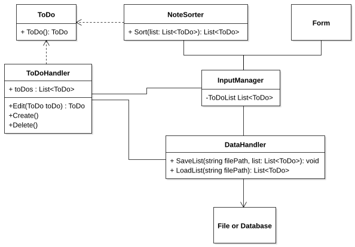
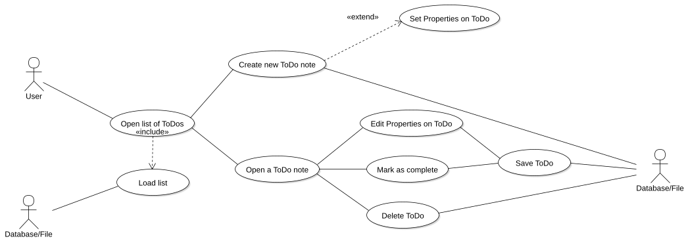
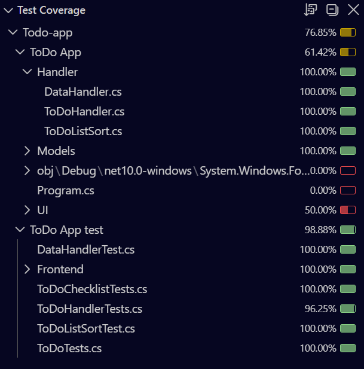

# Todo-app

## Project Description

## Project Techstack
- C#
- .NET
- Json
- NUnit

## Development Process
- We started by defining the initial requirements for the project and their priorities

## UML Diagrams
### Class Diagram

### Use case Diagram

## Project Testing
